# 14 — Diagrama Entidade-Relacionamento (Descrição Textual)

## Relacionamentos Principais

```
USUARIOS (1) ────< FAVORITOS >──── (1) TERREIROS
USUARIOS (1) ────< AVALIACOES >─── (1) TERREIROS
USUARIOS (1) ────< MEMBROS_TERREIRO >── (1) TERREIROS
USUARIOS (1) ────< POSTS_COMUNIDADE
USUARIOS (1) ────< PEDIDOS (comprador)
USUARIOS (1) ────< PRODUTOS (vendedor)
USUARIOS (1) ────< NOTIFICACOES
USUARIOS (1) ────< SESSEES

TERREIROS (1) ────< FOTOS
TERREIROS (1) ────< VIDEOS
TERREIROS (1) ────< HORARIOS_FUNCIONAMENTO
TERREIROS (1) ────< EVENTOS
TERREIROS (1) ────< AVALIACOES
TERREIROS (1) ────< FAVORITOS
TERREIROS (1) ────< MEMBROS_TERREIRO
TERREIROS (1) ────< TRANSACOES
TERREIROS (1) ────< EMBEDDINGS_TERREIRO
TERREIROS (1) ────< PRODUTOS (opcional)

CATEGORIAS_PRODUTO (1) ────< PRODUTOS
CATEGORIAS_PRODUTO (1) ────< CATEGORIAS_PRODUTO (auto-ref: parent_id)

PRODUTOS (1) ────< ITENS_PEDIDO
PEDIDOS (1) ────< ITENS_PEDIDO

GRUPOS_COMUNIDADE (1) ────< POSTS_COMUNIDADE
GRUPOS_COMUNIDADE (1) ────< MEMBROS_GRUPO
USUARIOS (1) ────< MEMBROS_GRUPO

USUARIOS (1) ────< AUDIT_LOGS (opcional: created_by)
```

## Diagrama ER (Mermaid)

```mermaid
erDiagram
    USUARIOS ||--o{ FAVORITOS : "favorita"
    USUARIOS ||--o{ AVALIACOES : "avalia"
    USUARIOS ||--o{ MEMBROS_TERREIRO : "é membro"
    USUARIOS ||--o{ POSTS_COMUNIDADE : "cria post"
    USUARIOS ||--o{ PEDIDOS : "compra"
    USUARIOS ||--o{ PRODUTOS : "vende"
    USUARIOS ||--o{ NOTIFICACOES : "recebe"
    USUARIOS ||--o{ SESSEES : "possui"
    USUARIOS ||--o{ AUDIT_LOGS : "auditado"

    TERREIROS ||--o{ FOTOS : "tem"
    TERREIROS ||--o{ VIDEOS : "tem"
    TERREIROS ||--o{ HORARIOS_FUNCIONAMENTO : "funciona"
    TERREIROS ||--o{ EVENTOS : "realiza"
    TERREIROS ||--o{ AVALIACOES : "recebe"
    TERREIROS ||--o{ FAVORITOS : "favoritado"
    TERREIROS ||--o{ MEMBROS_TERREIRO : "tem membros"
    TERREIROS ||--o{ TRANSACOES : "registra"
    TERREIROS ||--o{ EMBEDDINGS_TERREIRO : "indexado"
    TERREIROS ||--o{ PRODUTOS : "oferece"

    CATEGORIAS_PRODUTO ||--o{ PRODUTOS : "classifica"
    CATEGORIAS_PRODUTO ||--o| CATEGORIAS_PRODUTO : "subcategoria"

    PRODUTOS ||--o{ ITENS_PEDIDO : "contido em"
    PEDIDOS ||--o{ ITENS_PEDIDO : "contém"

    GRUPOS_COMUNIDADE ||--o{ POSTS_COMUNIDADE : "tem"
    GRUPOS_COMUNIDADE ||--o{ MEMBROS_GRUPO : "contém"
    USUARIOS ||--o{ MEMBROS_GRUPO : "participa"
    USUARIOS ||--o{ AUDIT_LOGS : "auditado"
```



## Tabelas e Cardinalidades

| Tabela | FK | Tipo | ON DELETE | Obrigatório |
|--------|----|------|-----------|-------------|
| terreiros | owner_id | UUID → usuarios | RESTRICT | Sim |
| fotos | terreiro_id | UUID → terreiros | CASCADE | Sim |
| videos | terreiro_id | UUID → terreiros | CASCADE | Sim |
| horarios_funcionamento | terreiro_id | UUID → terreiros | CASCADE | Sim |
| avaliacoes | terreiro_id | UUID → terreiros | CASCADE | Sim |
| avaliacoes | usuario_id | UUID → usuarios | CASCADE | Sim |
| favoritos | usuario_id | UUID → usuarios | CASCADE | Sim |
| favoritos | terreiro_id | UUID → terreiros | CASCADE | Sim |
| eventos | terreiro_id | UUID → terreiros | CASCADE | Sim |
| membros_terreiro | terreiro_id | UUID → terreiros | CASCADE | Sim |
| membros_terreiro | usuario_id | UUID → usuarios | CASCADE | Sim |
| transacoes | terreiro_id | UUID → terreiros | CASCADE | Sim |
| produtos | vendedor_id | UUID → usuarios | RESTRICT | Sim |
| produtos | terreiro_id | UUID → terreiros | SET NULL | Não |
| itens_pedido | pedido_id | UUID → pedidos | CASCADE | Sim |
| itens_pedido | produto_id | UUID → produtos | RESTRICT | Sim |
| posts_comunidade | usuario_id | UUID → usuarios | CASCADE | Sim |
| posts_comunidade | grupo_id | UUID → grupos_comunidade | CASCADE | Não |
| audit_logs | usuario_id | UUID → usuarios | SET NULL | Não |

## Índices Geoespaciais

```sql
-- PostGIS: Índice espacial para busca geográfica
CREATE INDEX idx_terreiros_geo ON terreiros USING GIST (geo_point) WHERE deleted_at IS NULL;

-- Query de exemplo: buscar terreiros num raio de 10km
SELECT *, 
  ST_DistanceSphere(geo_point, ST_MakePoint(-34.8811, -8.0632)) as distancia
FROM terreiros
WHERE deleted_at IS NULL
  AND is_published = true
  AND ST_DWithin(geo_point, ST_MakePoint(-34.8811, -8.0632)::geography, 10000)
ORDER BY distancia
LIMIT 20;
```

## Constraints Importantes

```sql
-- Uma avaliação por usuário por terreiro (com soft delete)
-- NOTA: UNIQUE com soft delete requer índice parcial ou trigger
-- Solução: índice parcial único

-- Para PostgreSQL < 15:
CREATE UNIQUE INDEX idx_avaliacoes_unique_active 
ON avaliacoes(terreiro_id, usuario_id) 
WHERE deleted_at IS NULL;

-- Para PostgreSQL 15+:
-- Podemos usar NULLS NOT DISTINCT
```

## Triggers e Functions

```sql
-- Trigger: Atualizar avaliacao_media e total_avaliacoes no terreiro
CREATE OR REPLACE FUNCTION atualizar_estatisticas_terreiro()
RETURNS TRIGGER AS $$
BEGIN
  UPDATE terreiros
  SET 
    avaliacao_media = (SELECT ROUND(AVG(nota)::numeric, 1) FROM avaliacoes WHERE terreiro_id = NEW.terreiro_id AND deleted_at IS NULL AND status = 'aprovado'),
    total_avaliacoes = (SELECT COUNT(*) FROM avaliacoes WHERE terreiro_id = NEW.terreiro_id AND deleted_at IS NULL AND status = 'aprovado')
  WHERE id = NEW.terreiro_id;
  RETURN NEW;
END;
$$ LANGUAGE plpgsql;

CREATE TRIGGER trg_atualizar_avaliacao
AFTER INSERT OR UPDATE OR DELETE ON avaliacoes
FOR EACH ROW EXECUTE FUNCTION atualizar_estatisticas_terreiro();
```
